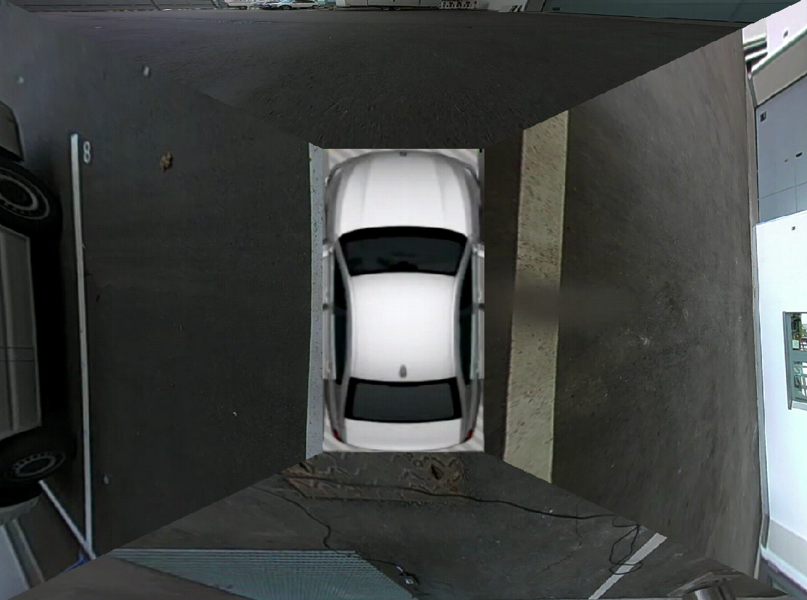

# What is this

An attempt at making a top-view video from four fish-eye cameras.
The app uses FFMpeg to decode video and GLSL shaders to rectify images and combine multiple video feeds into one.
Finally, it outputs the result into a GStreamer sink so that it can be
combined with other GStreamer pipelines.

This is an old project I did back in early 2017.

# Why FFMpeg AND GStreamer
I already had FFMpeg/OpenGL code at hand and was under some time constraints.

# Why glReadPixels
Same, plus portability, I did not want to hard-code driver specifics
for Intel VAAPI, and I developed the prototype on Mac OS X while the target
	ran Linux.
Just needed the demo to be fast enough on a particular board.

# Screenshot

